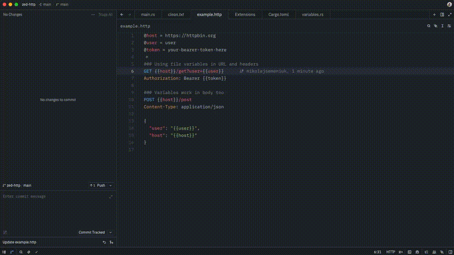

# REST Client for Zed

Send HTTP requests directly from `.http` and `.rest` files in Zed. Drop-in replacement for the [VS Code REST Client](https://marketplace.visualstudio.com/items?itemName=humao.rest-client) extension.



## Features

- 🎨 **Syntax highlighting** for `.http` and `.rest` files (HTTP methods, headers, URLs, JSON bodies)
- ▶ **Send requests** via code lens above each request
- 📄 **Response in a new tab** with formatted JSON, status code, and timing
- 🧩 **File variables** (`@host = ...` + `{{host}}`) for reusable values
- ⚙️ **System variables** (`{{$guid}}`, `{{$timestamp}}`, `{{$datetime}}`, `{{$randomInt}}`, `{{$processEnv}}`) for dynamic values
- 📦 **VS Code REST Client compatible** — copy-paste your existing `.http` files and they just work

## Prerequisites

You need the **`zed` CLI** installed and available in your `PATH`. The extension uses it to open response tabs.

To install the CLI:

1. Open Zed
2. Open the command palette: `cmd+shift+p` (macOS) or `ctrl+shift+p` (Linux/Windows)
3. Run: `cli: install cli binary`

Verify with:

**macOS / Linux:**

```bash
which zed
# Should print: /usr/local/bin/zed (or similar)
```

**Windows (PowerShell):**

```powershell
Get-Command zed
# Should print path to zed.exe
```

**Windows (Command Prompt):**

```cmd
where zed
# Should print path to zed.exe
```

If you skip this step, requests will be sent successfully but the response will not open in a new tab.

## Installation

1. Open Zed
2. Open the extensions panel: `cmd+shift+x` (or `cmd+shift+p` → `zed: extensions`)
3. Search for **REST Client**
4. Click **Install**

That's it. On first use, the extension downloads the LSP server binary for your platform from [GitHub Releases](https://github.com/mikolajsemeniuk/zed-rest-client-lsp/releases) (~5 MB, one-time download).

## Installation (zed dev extension)

If you want to install the extension from source for testing local changes or contributing, clone this repo and install it as a dev extension:

```bash
git clone https://github.com/mikolajsemeniuk/zed-rest-client.git
```

Then in Zed:

1. Open the command palette: `cmd+shift+p` (macOS) or `ctrl+shift+p` (Linux/Windows)
2. Run: `zed: install dev extension`
3. Select the cloned `zed-rest-client` folder

Zed will build the extension to WASM and load it. On first use it downloads the LSP server binary from [GitHub Releases](https://github.com/mikolajsemeniuk/zed-rest-client-lsp/releases) (same as the marketplace version).

After installation, the Extensions page will show "Overridden by dev extension" — meaning your local version is active.

## Quick start

Create a file `test.http` with the following content:

```http
### Simple GET request
GET https://httpbin.org/get
Accept: application/json

### POST with JSON body
POST https://httpbin.org/post
Content-Type: application/json

{
  "hello": "world",
  "n": 42
}
```

Click **▶ Send Request** above any request line. The response opens in a new tab.

## Examples

```http
@host = https://httpbin.org
@user = user
@token = your-bearer-token-here

### Simple GET request
GET https://httpbin.org/get
Accept: application/json

### Using file variables in URL and headers
GET {{host}}/get?user={{user}}
Authorization: Bearer {{token}}

### POST with JSON body
POST {{host}}/post
Content-Type: application/json

{
  "hello": "world",
  "n": 42
}

### Variables work in body too
POST {{host}}/post
Content-Type: application/json

{
  "user": "{{user}}",
  "host": "{{host}}"
}

### Each request gets a unique ID and timestamp
POST {{host}}/post
Content-Type: application/json
X-Request-ID: {{$guid}}
X-Timestamp: {{$timestamp}}

{
  "id": "{{$guid}}",
  "createdAt": "{{$datetime iso8601}}",
  "magicNumber": {{$randomInt 1 100}}
}

### Date with offset (3 hours ago)
GET {{host}}/get?since={{$timestamp -3 h}}

### Custom date format
GET {{host}}/get?date={{$datetime "%Y-%m-%d"}}

### Read from environment
GET {{host}}/get
X-User: {{$processEnv USER}}
```

### Available system variables

| Variable | Description | Example |
|----------|-------------|---------|
| `{{$guid}}` | UUID v4 | `f47ac10b-58cc-4372-a567-0e02b2c3d479` |
| `{{$timestamp}}` | Unix timestamp (UTC seconds) | `1745671234` |
| `{{$timestamp N unit}}` | Timestamp with offset (units: `s`, `m`, `h`, `d`, `w`, `y`) | `{{$timestamp -1 d}}` |
| `{{$datetime rfc1123}}` | RFC 1123 format | `Sun, 26 Apr 2026 13:00:00 GMT` |
| `{{$datetime iso8601}}` | ISO 8601 format | `2026-04-26T13:00:00Z` |
| `{{$datetime "FORMAT"}}` | Custom strftime format | `{{$datetime "%Y-%m-%d"}}` |
| `{{$randomInt min max}}` | Random integer in `[min, max)` | `{{$randomInt 1 100}}` |
| `{{$processEnv VAR}}` | Read environment variable | `{{$processEnv HOME}}` |

## Compatibility with VS Code REST Client

This extension supports the most commonly used features of the VS Code REST Client. Most `.http` files written for VS Code will work without changes.

**Currently supported:**
- All HTTP methods (`GET`, `POST`, `PUT`, `PATCH`, `DELETE`, `HEAD`, `OPTIONS`)
- Request separators (`###`)
- Comments (`#` and `//`)
- File variables and system variables
- JSON / XML / GraphQL body highlighting

**Not yet supported:**
- Request variables (chaining: `{{login.response.body.$.token}}`)
- Environment variables in `settings.json`
- `{{$dotenv}}` (use `{{$processEnv}}` for now)
- Authentication helpers (Basic, Bearer can be done manually with headers)
- curl import / code generation
- Cookie jar
- External body files (`< ./body.json`)

## Architecture

This extension is a thin WASM wrapper around a native LSP server written in Rust ([zed-rest-client-lsp](https://github.com/mikolajsemeniuk/zed-rest-client-lsp)). The LSP binary is downloaded automatically on first use from GitHub Releases.

## Issues / Contributing

Bug reports, feature requests, and pull requests are welcome at:
- Extension: https://github.com/mikolajsemeniuk/zed-rest-client/issues
- LSP server: https://github.com/mikolajsemeniuk/zed-rest-client-lsp/issues

## License

Apache License 2.0 — see [LICENSE](LICENSE).
